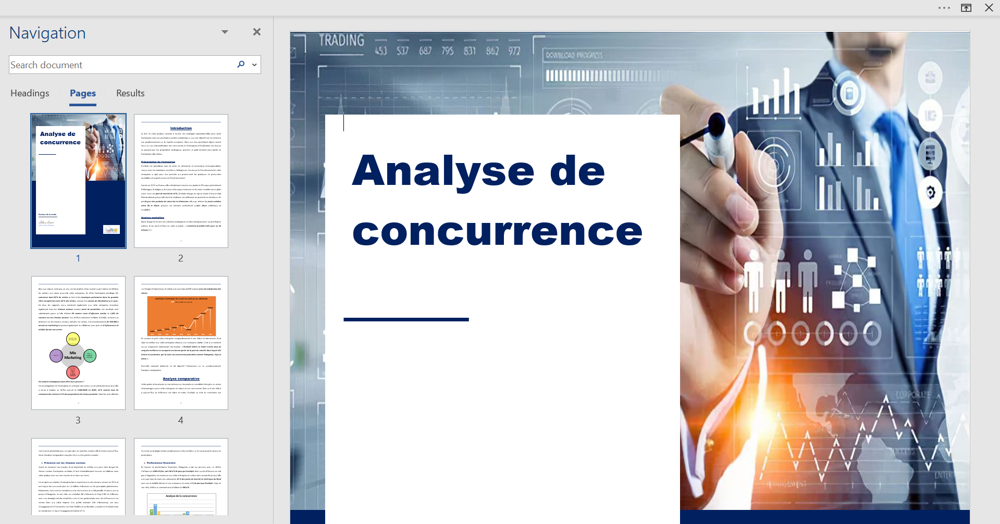

## IT Consultant in Innovative Technologies

### 👨‍🔬 Data Science |📊 Web Solution | Artificial Intelligence | 💻Web & Software development  

---

## 📧 About Me

I have a weakness for everything related to IT professions and for a long time, I wondered how to reconcile this strong love with my own nature. I don't like to appear that way, but I don't want to be that coder who just eats lines of code. I want to be proud to write thousands of lines and know in petto that these lines of code will be useful for something. This is how I decided to intervene as an **IT Consultant** in sectors such as humanitarian, health, marketing, banking and insurance, sociology and even psychology, helping companies, international organizations and humanitarian agencies to fully exploit the potential of their data and create innovative web solutions. My ability to combine rigorous analysis and technical creativity allows me to design tailor-made solutions that perfectly meet the specific needs of each project.

---

## 🚀 Tech Stack

---

### 🌟 Areas of Intervention

- **Humanitarian**
- **Health and Medicine**
- **Marketing**
- **Banking and Insurance**
- **Psychology**
- **Information Technology and Cybersecurity**

---

## 🤺 What I can do in this areas

As an **Expert in IT professions**, I can:

### **Humanitarian**:
- Optimize the distribution of resources through data analysis.
- Develop platforms for monitoring and managing humanitarian projects.

### **Health and Medicine**:
- Create predictive models for medical diagnoses.
- Develop web solutions for patient record management.

### **Marketing**:
- Analyze customer data to develop targeted marketing strategies.
- Develop interactive websites and marketing portals.

### **Banking and Insurance** :
- Implement data analysis for risk management and fraud detection.
- Design web applications for banking and insurance services.

### **Psychology** :
- Perform data analysis for psychological research.
- Develop online psychological support and monitoring platforms.

### **Information Technology and Cybersecurity** :
- Conduct data security audits and develop security protocols.
- Design and implement secure web solutions.

---

## 🛠️ Skills

### **Machine Learning & Modeling**:
- **Frameworks**: TensorFlow, Keras, Scikit-learn, PyCaret
- **Techniques**: Supervised, unsupervised, reinforcement learning, predictive models, clustering

### **Natural Language Processing (NLP)**:
- **Techniques**: Sentiment analysis, Named Entity Extraction (NER), Automatic Summarization, Text Generation
- **Tools**: NLTK, SpaCy, Hugging Face Transformers, Gensim, BERT
- **Skills**: Text data preprocessing, linguistic modeling, chatbot development

### **Deep Learning**:
- **Frameworks**: TensorFlow, Keras, PyTorch
- **Techniques**: Convolutional Neural Networks (CNN), Recurrent Neural Networks (RNN), Adversarial Networks Generative (GAN), Autoencoders
- **Applications**: Computer Vision, Natural Language Processing, Image Generation, Recommendation Models

### **Dashboard Development**:
- **Tools**: Streamlit, PowerBI, Tableau, Flask
- **Skills**: Interactive Dashboard Creation, Data Visualization, Real-Time Data Analysis

### **Programming Languages**:
- **Main**: Python, C/C++
- **Others**: SQL, JavaScript, HTML/CSS

### **Big Data & Data Pipeline**:
- **Technologies**: Apache Spark
- **Skills**: Large-scale data processing, data pipelines, data ingestion and transformation

### **Data Visualization**:
- **Libraries**: Matplotlib, Seaborn, Plotly, D3.js
- **Skills**: Static and interactive charting, advanced visualization, storytelling with data

### **Cybersecurity**:
- **Domains**: Data security analysis, security protocol development
- **Tools**: Wireshark, nmap, Metasploit, network security tools

### **Project Management & Methodologies**:
- **Methods**: Agile, Scrum, Kanban
- **Skills**: Project planning, team management, sprint tracking

---

## 📚 Projects

### [✅📊Customer Segmentation for a Marketing Campaign](https://github.com/Abdiasarsene/Customer_segmentation_for_a_Marketing_Campaign)
- **Description**:This project aims to segment a company's customers into distinct groups using unsupervised learning algorithms. The goal is to optimize marketing campaigns by offering tailored promotions to each customer segment.
- **Tech Used**: Scikit-learn, Seaborn, Matplotlib
- **Methods** : PCA, Elbow and Silhouette Methods, KMeans
- **Field** : Marketing - Ecommerce sector

### [📈📊Développement d'un Tableau de Bord de la Chaîne d'Approvisionnement ](https://github.com/Abdiasarsene/Developpement_Tableau_de_Bord_de_la_Chaine_Approvisionnement_Power_BI)
- **Description**:Le projet de visualisation et prédiction des données de la chaîne d'approvisionnement est maintenant finalisé. Il comprend un **tableau de bord Power BI** interactif pour l'analyse des performances, un **modèle prédictif de Machine Learning** permettant d'anticiper les retards et les besoins de réapprovisionnement, ainsi qu'une **API REST déployée avec Docker** pour fournir des prédictions en temps réel. Le suivi et l'optimisation des modèles ont été assurés via **MLflow**, garantissant une gestion efficace des expériences ML et une amélioration continue. Cette solution permet désormais une prise de décision plus rapide et éclairée.
- **Tech Utilisées**: Scikit-learn, Seaborn, Matplotlib,FastAPI, Docker, CI/CP Pipeline, PowerBI, MLflow
- **Domaine** : Logistique

### [👨‍👩‍👧‍👦📊EducSight : Data Driven Insights for Smart Education](https://github.com/Abdiasarsene/EduSight-Data-driven-Insights-for-Smarter-Education)
- **Description**: EduSight is a data visualization project designed to transform educational data into actionable insights. It helps NGOs, schools, and policymakers monitor academic performance, optimize teaching resources, and assess learning program effectiveness, driving smarter decisions for better education outcomes..
- **Tech Used**: Excel, PowerBI
- **Field** : Humanitarian Aid

### [⚖️👩‍⚖️ LexEmotion - An Intelligent Dashboard](https://github.com/Abdiasarsene/LexEmotion-An-Intelligent-Dashboard)
- **Description**: An Intelligent Dashboard for Emotion and Theme Detection in Legal Case Reports. LexEmotion is a cutting-edge NLP dashboard designed for legal professionals, law firms, and investigators. It leverages the latest advances in Natural Language Processing to extract emotions, detect key themes, and summarize incident or legal reports — in multiple languages and formats.
- **Tech Used**: Seaborn, Matplotlib, Fitz, SpaCy, Transformers, Langdetect, Googletrans
- **Méthodes** : Advanced Emotion Detection, Topic Extraction & Summarization, Interactive Dashboard, Scalable Architecture
- **Field** : Law

### [🤒💉Prédiction des Maladies et Proposition de Traitement](https://github.com/Abdiasarsene/Prediction_des_Maladies_et_Proposition_de_Traitement)
- **Description**: Ce projet propose une API intelligente construite avec FastAPI pour prédire des maladies à partir de données médicales de patients. L'application repose sur un modèle de machine learning (Logistic Regression) géré via MLflow, et peut facilement être déployée grâce à Docker.
- **Tech Utiisées**: Seaborn, Matplotlib, FastAPI, MLflow, Docker, Jenkins, CI/CD Pipeline
- **Field** : Santé
  
### [✅📊12-month sales analysis and prediction report](https://github.com/Abdiasarsene/datascience_projects/blob/main/analyse%20%26%20prediction%20des%20ventes/analyse_prediction_vente_ecommerce.ipynb)
- **Description**: A sales analysis and prediction for the next 12 months, followed by the creation of a dashboard with Power BI. The prediction of the models is done using models such as the ARIMA model and the random forest. The predictive capacity of the model was achieved through the performance metric, the RMSE.
- **Tech Used**: Python, Scikit-learn, Seaborn, Matplotlib
- **Field** : Marketing - Ecommerce sector

### [✅📈Sentiment and Emotion Analysis of Visitor Reviews for Improving Gym Services](https://github.com/Abdiasarsene/datascience_projects/blob/main/salle_gymn_sport/avissportif.ipynb)
- **Description**: Sentiment and emotion analysis of visitor reviews to improve the services of a new gym. I used advanced NLP techniques to identify and evaluate reviews to provide accurate recommendations for service improvement.
- **Tech Used**: Python, NLTK, VADER, Scikit-learn, Seaborn, Matplotlib,
- **Fields**: Health and Wellness, Data Analytics, Customer Service

---

## 🌐 Get In Touch

